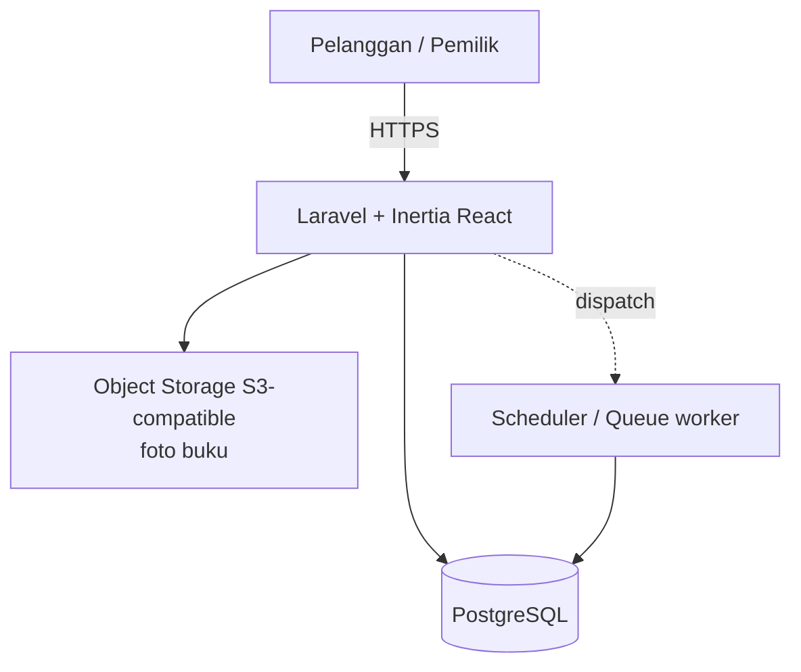

# Architecture — Kayana Book

**Status:** Draft v1 · **Tanggal:** 2026-06-20 · Dokumen teknis pendamping [`PRD-MVP.md`](PRD-MVP.md).
PRD = *apa & kenapa*. Dokumen ini = *gimana* (data model, alur, DB, deploy, keputusan).

---

## 1. Stack & Overview

Laravel 13 · Inertia v3 · React 19 · Tailwind 4 · **PostgreSQL** · Wayfinder (typed routes) · Radix UI.

Pola: **Modular monolith** (1 dev, domain jelas, iterasi cepat — tidak perlu microservices). Domain: katalog buku bekas stok-unik + penjualan online.

## 2. System Architecture



- **App:** monolith Laravel, render via Inertia (SSR otomatis di dev).
- **DB:** PostgreSQL (lihat ADR-002).
- **Object storage:** foto buku di S3-compatible storage saat produksi (ADR-005). Lokal dev boleh `storage/app/public`.
- **Scheduler/Queue:** job terjadwal lepas item `reserved` yang kadaluarsa (ADR-004). Driver `database` cukup untuk MVP; Redis nanti kalau scaling.

### Lingkungan
| | Dev | Produksi |
|---|---|---|
| DB | PostgreSQL via Docker/Laravel Sail | PostgreSQL managed (Laravel Cloud) |
| Foto | disk lokal | object storage S3 |
| Queue/Cache/Session | driver `database` | `database` → Redis saat butuh |

> Catatan: `.env` masih default `sqlite`. Pindah ke `pgsql` saat setup Fase 1 (provision Postgres via Sail dulu, baru ubah config — jangan ubah sebelum server jalan biar app tidak rusak).

---

## 3. Data Model

> App saat ini hanya punya tabel `users`. Semua di bawah baru. Uang = **integer rupiah** (`unsignedBigInteger`), hindari float.

### `books` — katalog item = satu eksemplar fisik
| Kolom | Tipe | Catatan |
|---|---|---|
| id | bigint PK | |
| title | string | wajib |
| slug | string unique, index | SEO detail publik (ADR ref D2) |
| author | string nullable | |
| isbn | string nullable | buku bekas sering tanpa ISBN |
| description | text nullable | |
| condition | enum(`new`,`like_new`,`good`,`fair`,`poor`) | kondisi fisik |
| is_new | boolean default false | baru vs bekas |
| price | unsignedBigInteger | harga jual, rupiah |
| cost_price | unsignedBigInteger nullable | harga modal, privat — laporan untung fase 2 (ADR-... Q4) |
| status | enum(`available`,`reserved`,`sold`) default `available`, **index** | |
| category_id | FK nullable → categories, **index** | nullable = boleh dikategorikan nanti (input cepat) |
| language | enum(`id`,`en`,`lainnya`) default `id` | filter |
| audience | enum(`anak`,`remaja`,`dewasa`,`umum`) default `umum` | filter |
| sold_at | timestamp nullable | |
| deleted_at | timestamp nullable | **softDeletes** — jaga riwayat order (ADR-009) |
| timestamps | | |

### `book_images` — **P0**, single source of truth foto (ADR-006)
| Kolom | Tipe | Catatan |
|---|---|---|
| id | bigint PK | |
| book_id | FK → books, **index** | |
| path | string | lokasi di object storage |
| is_primary | boolean default false | foto utama (ganti `cover_image`) |
| sort_order | unsignedInteger default 0 | |
| timestamps | | |

> `books` **tidak** menyimpan path foto. Foto utama = `book_images.where(is_primary)`. MVP wajib ≥1 foto; tambah foto jalan tanpa migrasi lagi.

### `categories` — **P0**
`id, name, slug (unique), parent_id (nullable, 2-level fase 2), sort_order, timestamps`

Kategorisasi multi-dimensi (jangan campur 1 kolom):

| Sumbu | Tempat | Tipe | Guna |
|---|---|---|---|
| Genre | `categories` → `books.category_id` | 1 primary, pemilik tambah sendiri | navigasi utama |
| Bahasa | `books.language` | enum | filter |
| Segmen umur | `books.audience` | enum | filter |
| Kondisi | `books.condition` | enum | filter |
| Baru/bekas | `books.is_new` | bool | filter |

Genre = **tabel** bukan enum (pemilik tambah tanpa ubah kode). 1 buku = 1 genre primary; tags many-to-many ("langka","edisi pertama") = fase 2. Flat dulu; `parent_id` disiapkan tapi belum dipakai.

**Seed kategori awal (~14, flat):**
```
Fiksi: Novel · Sastra · Fantasi & Sci-Fi · Misteri & Thriller · Komik & Manga
Non-Fiksi: Biografi · Sejarah · Pengembangan Diri · Bisnis & Ekonomi ·
           Agama & Religi · Sains & Teknologi · Psikologi & Filsafat
Pendidikan: Buku Pelajaran & Kuliah · Kamus & Bahasa
Anak: Buku Anak
```

### `orders`
| Kolom | Tipe | Catatan |
|---|---|---|
| id | bigint PK | |
| user_id | FK → users nullable, **index** | pelanggan (nullable utk offline fase 2) |
| status | enum(`pending`,`paid`,`completed`,`cancelled`) default `pending`, **index** | lifecycle §4.2 |
| channel | enum(`online`,`offline`) default `online` | siapkan POS fase 2 |
| subtotal | unsignedBigInteger | Σ harga item (dihitung server) |
| shipping_cost | unsignedBigInteger default 0 | ongkir manual; 0 jika pickup |
| total | unsignedBigInteger | subtotal + shipping_cost (server-side, ADR D3) |
| customer_name | string | snapshot |
| customer_phone | string | |
| fulfillment | enum(`pickup`,`ship`) | ambil di toko / kirim |
| shipping_address | text nullable | |
| payment_method | enum(`transfer`,`cash`) default `transfer` | MVP: transfer manual |
| expires_at | timestamp nullable, **index** | pending lewat ini → auto-cancel (ADR-004) |
| cancel_reason | string nullable | mis. `expired`, `dibatalkan pemilik` |
| paid_at | timestamp nullable | |
| timestamps | | |

### `order_items`
| Kolom | Tipe | Catatan |
|---|---|---|
| id | bigint PK | |
| order_id | FK → orders, **index** | |
| book_id | FK → books nullable (set null on delete), **index** | item unik |
| title | string | snapshot judul |
| price | unsignedBigInteger | snapshot harga |
| timestamps | | |

**Relasi:** Order hasMany OrderItem · OrderItem belongsTo Book · Book hasMany BookImage · Book belongsTo Category · Order belongsTo User.

**Catatan:** Tiap buku unik → `order_items` selalu qty=1, tidak perlu kolom quantity. Saldo stok = `books.where(status,'available')->count()`. Snapshot `title`+`price` di `order_items` → struk tetap terbaca walau buku di-soft-delete.

---

## 4. Key Flows

### 4.1 Checkout — anti double-sell (DB-agnostic)
Jaminan **bukan** dari `lockForUpdate` (no-op di SQLite) tapi dari **conditional update atomik** — benar di Postgres & SQLite (ADR-003):

```
Pelanggan klik "Checkout" (dalam DB transaction):
  1. Untuk tiap book_id di cart:
       UPDATE books SET status='reserved'
       WHERE id=? AND status='available'
     → cek affected rows.
  2. Jika ADA yang affected=0 → buku sudah diambil orang →
       ROLLBACK, pesan "buku X sudah laku".
  3. Buat order (pending, expires_at = now + 24 jam) + order_items (snapshot judul+harga).
  4. Hitung subtotal/total SERVER-SIDE (jangan percaya client).
  5. COMMIT.
  → tampilkan instruksi transfer bank.

Pemilik verifikasi transfer → PATCH order=paid:
  → item reserved → sold, sold_at=now, paid_at=now.

Order cancelled / expired:
  → item reserved → available (hanya jika masih milik order itu).
```

### 4.2 Order lifecycle
```
pending ──(pemilik konfirmasi bayar)──> paid ──(diserahkan/dikirim)──> completed
   │                                       
   └──(expires_at lewat / dibatalkan)──> cancelled
```
- `pending`: item `reserved`, tunggu bayar.
- `paid`: item `sold`.
- `completed`: sudah diambil/dikirim (status operasional final).
- `cancelled`: item kembali `available`. `cancel_reason` isi alasan.

### 4.3 Reserve TTL release (ADR-004)
Scheduled command (`app/Console`, `php artisan schedule`):
```
Tiap N menit: ambil orders status=pending DAN expires_at < now
  → set order=cancelled (reason=expired)
  → item reserved milik order itu → available
```
Tanpa ini, cart ditinggal = buku stok-unik terkunci selamanya. **P0.**

### 4.4 Cart (ADR-007)
- **Session-based** (MVP), bukan tabel DB.
- Add-to-cart **TIDAK** reserve. Reserve hanya saat checkout (4.1).
- Konsekuensi: 2 orang boleh punya buku sama di cart; yang menang = checkout duluan. Ditangani conditional update.

---

## 5. Routes

```
# Publik
GET  /catalog                 katalog (index, filter)   → CatalogController@index
GET  /catalog/{book:slug}     detail buku               → CatalogController@show

# Pelanggan (auth + verified)
POST /cart/{book}             tambah ke keranjang (session)
GET  /cart                    lihat keranjang
DELETE /cart/{book}           hapus dari keranjang
POST /checkout                buat order + reserve       → CheckoutController@store
GET  /orders                  riwayat order pelanggan
GET  /orders/{order}          detail + instruksi bayar

# Pemilik (auth + gate admin)
GET/POST/PUT/DELETE /admin/books        kelola item     → Admin\BookController
GET    /admin/orders                    kelola order
PATCH  /admin/orders/{order}            ubah status (paid/cancel/complete)
GET    /admin/categories                kelola kategori
GET    /admin/dashboard                 omzet & laporan
```

## 6. Auth & Roles
- Reuse Fortify (sudah ada): registrasi, login, verifikasi email, 2FA.
- Peran pemilik: kolom `users.is_admin` (boolean) + Gate `admin`. Route `/admin/*` dijaga gate.
- Checkout butuh user login + verified.

## 7. Frontend (Inertia React) — `resources/js/pages`
`catalog/index`, `catalog/show`, `cart/index`, `checkout/index`, `orders/index`, `orders/show`, `admin/books/index`, `admin/books/form`, `admin/orders/index`, `admin/categories/index`, `admin/dashboard`. Panggil route via Wayfinder (typed); UI pakai komponen Radix yang ada.

## 8. Storage Foto (ADR-005)
- Foto buku = inti konversi jualan buku bekas.
- **Produksi: object storage S3-compatible** — filesystem kontainer/Laravel Cloud ephemeral, foto lokal hilang tiap redeploy.
- Dev: `storage/app/public` + `php artisan storage:link`.
- Config lewat filesystem disk Laravel (`config/filesystems.php`), swap via `.env` — kode pakai `Storage::disk()` agar portable.

## 9. Non-Functional Requirements
- **Anti double-sell:** conditional update atomik dalam transaction (4.1). Bukan `lockForUpdate`.
- **Integritas uang:** `total` dihitung server-side; harga snapshot di `order_items`; integer rupiah.
- **Performa:** katalog paginasi/infinite scroll (Inertia merge props); eager-load `book_images` + `category` (hindari N+1); index di kolom filter & FK.
- **Keamanan:** route `/admin/*` gate admin; checkout verified user; jangan percaya harga/total dari client.
- **Mobile-first:** pemilik input via HP (foto pakai kamera).

---

## 10. Decision Log (ADR)

Format ringkas: konteks → keputusan → trade-off.

**ADR-001 — Model stok unik (1 buku = 1 baris).**
Mayoritas buku bekas, jarang >2 eksemplar sama. → Tiap eksemplar = 1 baris `books` dengan kondisi/harga/status sendiri; tak ada "qty". Trade-off: input per-eksemplar (mahal kalau stok seragam), tapi cocok 100% untuk buku bekas.

**ADR-002 — PostgreSQL (bukan SQLite/MySQL).**
Checkout online = pembeli bisa konkuren; stok unik butuh konsistensi kuat. → Postgres (row-lock asli, search kuat, managed di Laravel Cloud). SQLite hanya untuk eksperimen lokal cepat. Trade-off: perlu server DB (mudah via Sail/managed).

**ADR-003 — Reserve via conditional update atomik (bukan `lockForUpdate`).**
`lockForUpdate` no-op di SQLite & gampang salah pakai. → `UPDATE ... WHERE status='available'` + cek affected rows, dalam transaction. Benar lintas DB, portable. Trade-off: tak ada.

**ADR-004 — Reserve punya TTL + job pelepas.**
Stok unik: 1 cart ditinggal = buku terkunci selamanya. → `orders.expires_at` + scheduled command auto-cancel pending & balikin item. Trade-off: butuh scheduler aktif (`php artisan schedule:run` cron).

**ADR-005 — Foto di object storage (produksi).**
Filesystem kontainer ephemeral. → S3-compatible disk untuk foto; kode pakai `Storage::disk()`. Trade-off: butuh kredensial storage di prod.

**ADR-006 — `book_images` single source, buang `cover_image`.**
Dua sumber (string di `books` + tabel) = rawan desync. → Semua foto di `book_images`, utama via `is_primary`. Trade-off: query 1 join untuk cover (murah, di-eager-load).

**ADR-007 — Cart session-based, reserve saat checkout.**
Reserve di add-to-cart akan kunci stok terlalu agresif. → Cart di session; reserve hanya saat checkout. Trade-off: buku di cart bisa keduluan orang (ditangani ADR-003) — UX dapat pesan jelas.

**ADR-008 — Pembayaran manual (transfer) untuk MVP.**
Gateway nambah integrasi+biaya. → MVP: pelanggan transfer, pemilik tandai lunas. Trade-off: verifikasi manual; gateway = fase 2.

**ADR-009 — softDeletes di `books`.**
Buku terjual direferensi `order_items`; hard delete rusak riwayat. → softDeletes; `order_items.book_id` nullable on-delete-set-null + snapshot judul/harga. Trade-off: query default exclude trashed (perlu `withTrashed` di laporan historis).
